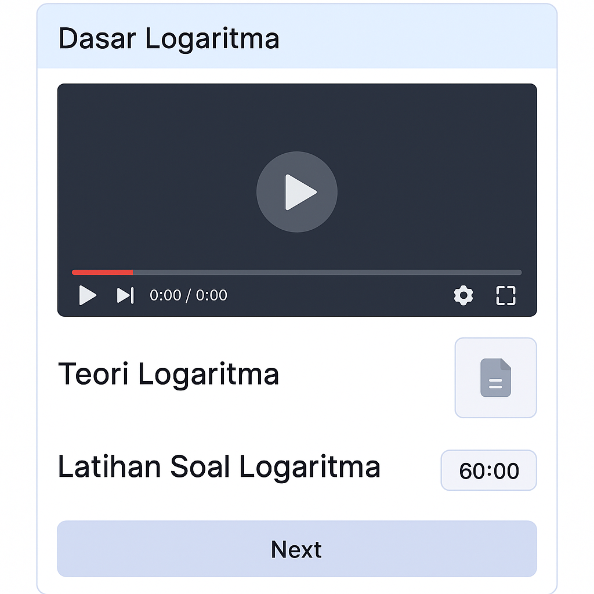

# 📚 Belajarin Aja Yuk

Belajarin Aja Yuk is a modern e-learning mobile application built with Flutter. The platform helps students access learning materials, watch educational videos, complete quizzes, and interact with an AI-powered learning assistant to enhance their learning experience.

---

## 🚀 Features

### Authentication
- User Registration
- User Login
- Secure Authentication

### Learning Module
- Browse Learning Materials
- Video-Based Learning
- Organized Course Categories
- Progress Tracking

### Quiz & Assessment
- Interactive Quizzes
- Score Calculation
- Learning Evaluation

### AI Learning Assistant
- AI-powered chatbot
- Learning guidance and support
- Question and answer assistance

### User Profile
- Profile Management
- Learning Progress Overview
- Account Settings

---

## 🛠️ Tech Stack

| Category | Technology |
|-----------|------------|
| Framework | Flutter |
| Language | Dart |
| State Management | Riverpod |
| Backend | Firebase |
| Authentication | Firebase Auth |
| Database | Cloud Firestore |
| AI Integration | OpenAI API |
| Version Control | Git & GitHub |

---

## 📂 Project Structure

```text
belajarin_aja_yuk/
│
├── android/
├── ios/
├── web/
├── linux/
├── macos/
├── windows/
│
├── lib/
│   ├── core/
│   │   ├── constants/
│   │   ├── services/
│   │   └── utils/
│   │
│   ├── features/
│   │   ├── auth/
│   │   ├── home/
│   │   ├── course/
│   │   ├── profile/
│   │   └── chatbot/
│   │
│   ├── widgets/
│   └── main.dart
│
├── assets/
│   ├── images/
│   ├── icons/
│   └── animations/
│
├── docs/
│   └── screenshots/
│
├── test/
│
├── pubspec.yaml
├── README.md
└── LICENSE
```

---

## ⚙️ Installation

### Clone Repository

```bash
git clone https://github.com/fernandozicofarelli/belajarin_aja_yuk.git
```

### Navigate to Project Folder

```bash
cd belajarin_aja_yuk
```

### Install Dependencies

```bash
flutter pub get
```

### Run Application

```bash
flutter run
```

---

## 📱 Screenshots

### Icon Page


### introducing


### Quiz Page


### Matei



---

## 🎯 Project Goals

This project was developed to:

- Improve digital learning accessibility.
- Provide an engaging mobile learning experience.
- Integrate AI technology into education.
- Demonstrate Flutter mobile development skills.
- Showcase Firebase and AI integration capabilities.

---

## 🔮 Future Improvements

- Dark Mode Support
- Personalized Learning Recommendations
- Offline Learning Mode
- Live Classes Integration
- Learning Analytics Dashboard
- Multi-language Support

---

## 🤝 Contributing

Contributions, issues, and feature requests are welcome.

Feel free to fork this repository and submit pull requests.

---

## 📄 License

This project is licensed under the MIT License.

---

## 👨‍💻 Author

**Fernando Zico Farelli**

Information Systems Student at Universitas MH Thamrin Jakarta

### Connect With Me

- GitHub: https://github.com/fernanozicofarelli
- LinkedIn: linkedin.com/in/fernando-zico-farelli-16b286324

---

⭐ If you like this project, don't forget to give it a star on GitHub!